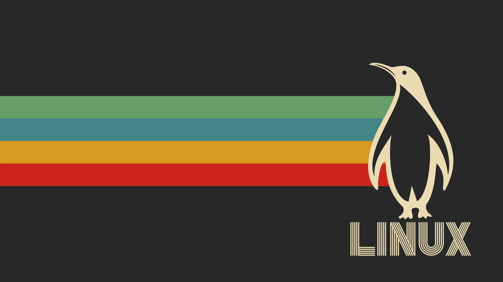

### Hi there 👋, ¡Hey, que tal?!
#### Estudiante de Ingeniería en Computación | CyberSec Enthusiast

Aquí se encuentran algunos proyectos: mios

Skills: Python / C# / Linux / Git / JavaScript 

  

  

