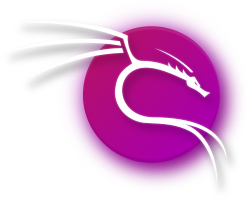

### Hi there 👋, ¡Hey, que tal?!
#### Estudiante de Ingeniería en Computación | CyberSec Enthusiast

<h3 align="left">Contáctame:</h3>

<h3 align="left">

Aquí se encuentran algunos proyectos: mios

<h3 align="left">Languages and Tools:</h3>

  

- 

