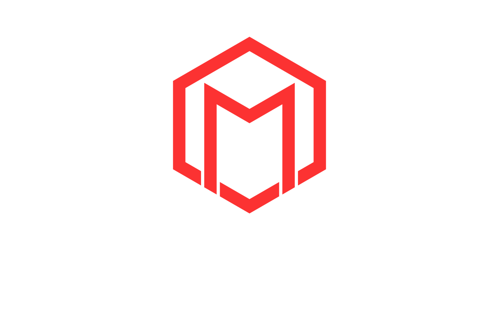

### Hacker, friend.

#### Estudiante de Ing. en Computación | Info Sec & Information Systems Security Analyst
#### On a journey to become a read Team Operator 

<h3 align="left">Contáctame:</h3>

  

### 🛠️ Tech Stack

  
  
  
  
  
  

### 🔒 Seguridad y Análisis

## 💻 Mi Entorno de Desarrollo

  

**Arch Linux** + **Hyprland** | [Ver configuración completa](https://github.com/DarkStalkr/Dotfiles-Hyprland)
### Especificaciones del Sistema
- **CPU**: Intel Core Ultra 7 155H @ 4.80 GHz
- **GPU**: Intel Arc Graphics (Integrada)
- **RAM**: 32GB
- **Pantalla Principal**: 3072x1920 @ 165 Hz (16")
- **Pantalla Externa**: 1920x1080 @ 120 Hz (27")

<h3 align="left">Labs:</h3>

  
  
  

  

### 🚀 Featured Projects

